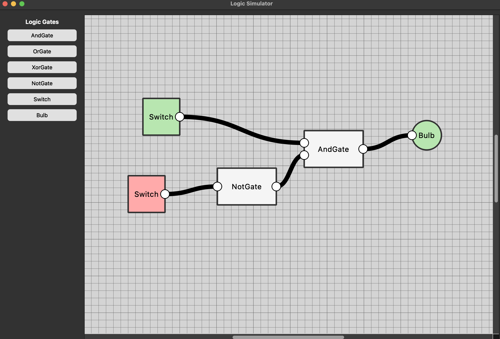

# Logic Simulator MVVM

A logic simulator built with **Python 3.12** and **PySide6**, following the **MVVM (Model-View-ViewModel)** architecture.  

---

## Features

- MVVM architecture, view-viewmodel interaction using ids
- GUI built with **PySide6**
- Supported component drag and drop
- Interactable canvas and components
- Undo and Redo commands
- Fully independent model for creating logic circuits

---

## Screenshots



---

## Requirements

- Python 3.12  
- PySide6  

---

## Installation

1. Clone the repository
2. Install dependencies
3. Run using   
```
python -m logicsimulator.main   
```